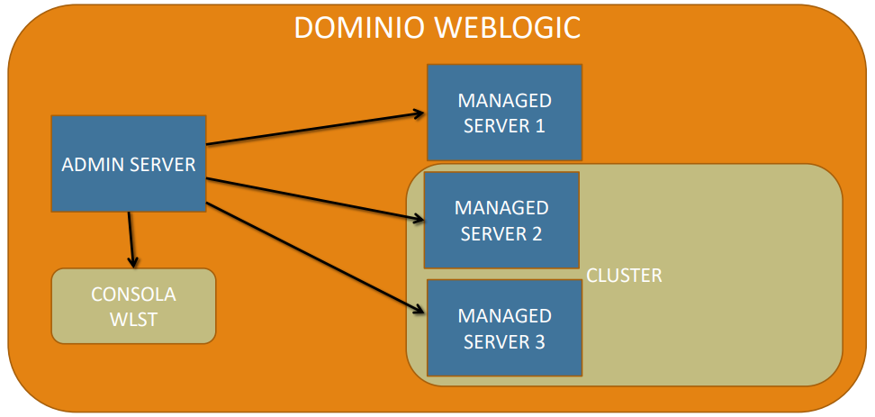
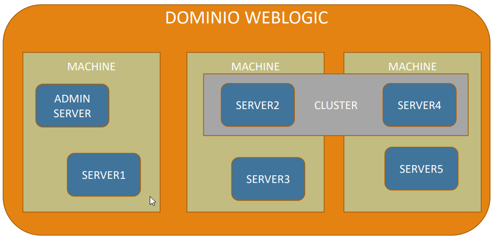

# ORACLE WEBLOGIC

## OBJETIVOS DEL CURSO

* Conocer la arquitectura de WebLogic
* Instalar y Configurar WebLogic
* Conocer los diferentes tipos de servidores en un entorno WebLogic
* Iniciar y detener un servidor WebLogic
* Cómo utilizar Node Manager para trabajar de forma remota con servidores WebLogic
* Desplegar aplicaciones Java en WebLogic Server
* Implementar Seguridadd WebLogic
* Crear clusters de servidores
* Hacer copias de seguridad y recuperación

## CONTENIDO DEL CURSO

* Introducción, Arquitectura, Instalación
* Dominios
* Consola de Administración
* Managed Servers
* WLST
* Despliegue de aplicaciones
* Monitorización del dominio
* Redes y Canales
* Clusters
* Transacciones, Seguridad, etc.

## INSTALACIONES

Descargar Oracle WebLogic Server

> https://www.oracle.com/middleware/technologies/weblogic-server-downloads.html

Descomprimimos y ejecutamos desde la consola o terminal con privilegios de administrador.

> java -jar fmw_12.2.1.4.0_infrastructure.jar

Recuerda que desde la consola o terminal debes estar pocisionado en la carpeta donde se encuentra descomprimido el archivo descargado.

Realizamos la instalación.

Seguimos los pasos que se indican en el archivo:

[Instalación](Instalar_Weblogic.pdf)

## ESTRUCTURA DE ARCHIVOS

La carpeta donde se realizó la instalación de un producto Oracle es conocida como `ORACLE_HOME`.

### CFGTOOLLOGS

Contiene ficheros de logs que se han producido durante el proceso de instalación y similares de las herramientas y del propio WebLogic.

### COHERENCE

Es un directorio donde se guardan todos los binarios y los ficheros del producto.

### EM

Contiene la consola de `Enterprise Manager` incluida la consola del `Enterprise Manager Fusion Control`, que nos permite administrar toda la parte del Middleware de WebLogic, así como gestionar los productos adicionales que instalamos en WebLogc.

### INVENTORY

Contiene todos los metadatos necesarios sobre los componentes, características y parches que se han instalado en el Oracle Home.

### OPATCH

Contiene los binarios para parchear, así como todas las librerías necesarias.

### ORACLE_COMMON

Contiene todos los binarios y librerías comunes a WebLogic Server

### OUI

Contiene los ficheros necesarios para el Oracle Universal Install, es decir, para el instalador y desinstalador.

### WLSERVER

Conocida como el `WL_Home`, es el core, en ella se encuentran los ficheros de productos y todo lo necesario de WebLogic.

## CARACTERISTICAS

* Servidor de aplicaciones de tipo JEE (Java Enterprise Edition)
* Se ejecuta sobre una JVM (Java Virtual Machine)
* Compatible con Java EE 7
* Permite trabajar en cluster y alta disponibilidad con una gran escalabilidad y rendimiento
* Permite ejecutar aplicaciones de tipo Fussion Middleware de Oracle
    * SOA
    * Oracle Service Bus
    * Oracle BI
    * Oracle BPM
    * Oracle Identity

## ARQUITECTURA

En primer lugar debemos conocer el concepto de dominio, que en realidad es un concepto lógico, no es un objeto, es el nombre que se le da a un conjunto de servidores web, donde cada servidor WebLogic es una JVM. Los dominios son un conjunto de servidores que contienen una serie de recursos comunes a los que pueden acceder y también tienen acceso a toda la parte del software de Java, de las librerías, etc., es decir, digamos que tenemos un conjunto de servidores que tienen de alguna manera un comportamiento colaborativo o conjunto. Esto es un dominio WebLogic y es el concepto más importante que debemos conocer. Dominio es un grupo de servidores WebLogic que tienen en común una serie de recursos y características.

Cuidado de no confundir dominio con cluster, puesto que dentro de un dominio podemos crear un cluster, y un cluster es un conjunto de servidores que tienen los mismos recursos y se comportan de la misma manera.

Dentro del dominio WebLogic existe lo que se conoce como Admin Server. Admin Server es un servidor WebLogic que exclusivamente se utiliza para administrar. En producción, el Admin Server sólo debe tener la consola que es la herramienta que se utiliza para administrar el servidor WebLogic. Esta consola se conoce como `WLST`.

A parte de contener la consola `WLST`, existen una serie de servidores que se denominan `Managed Server`, o servidores gestionados. Estos servidores son los que gobierna entre comillas el Admin Server, y que contienen las aplicaciones que vamos a ejecutar en un servidor webLogic. Una característica interesante es, que estos servidores gestionados se pueden agrupar bajo un cluster, de forma que esos servidores agrupados van a contener los mismos recursos, las mismas aplicaciones, se comportan igual.

Otro concepto que es parte de la arquitectura de un servidor WebLogic, pero con un enfoque físico, es `Machine`. Los `Machines` son entes lógicos, no son máquinas físicas pero suelen estar asociadas a máquinas físicas.

